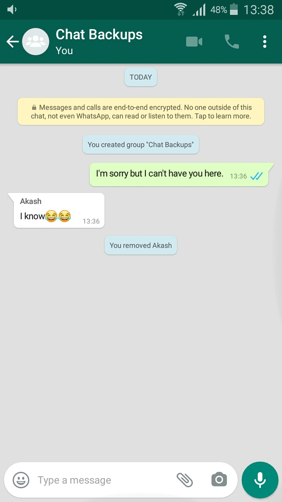
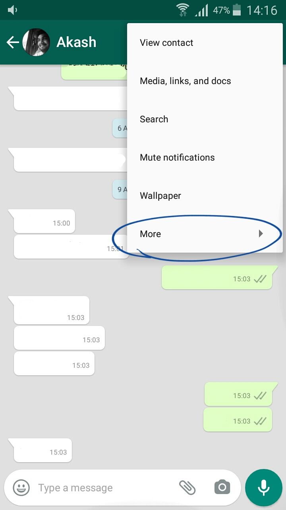
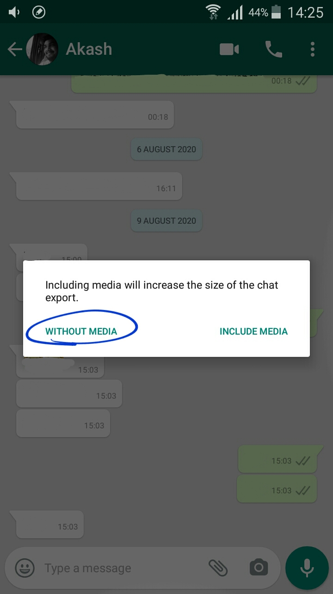
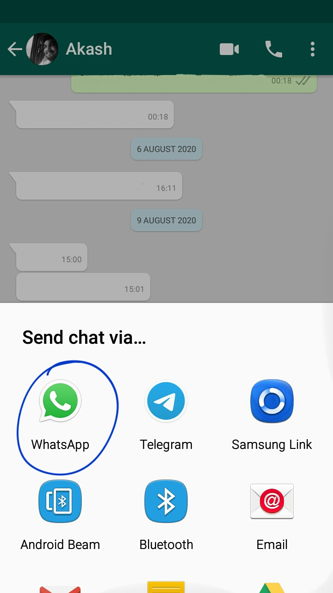
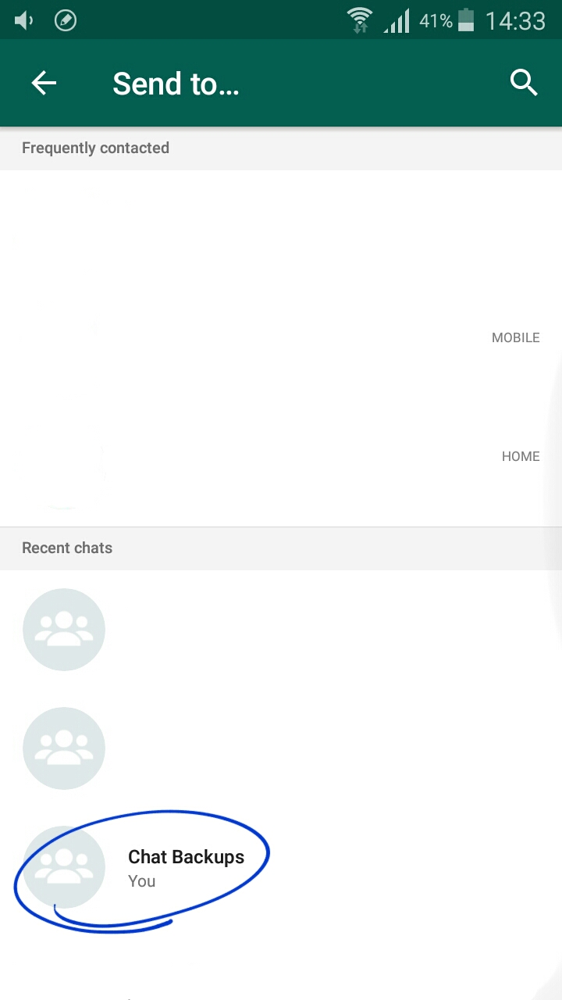
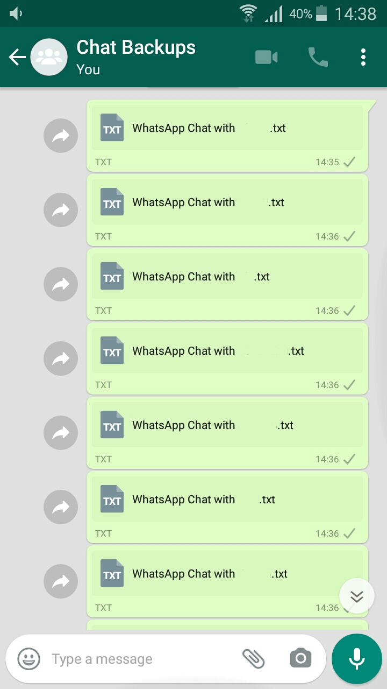

# A Bot that talks like you!

[](https://shields.io/)
[](https://shields.io/)
[](https://shields.io/)
[](https://github.com/Naereen/StrapDown.js/blob/master/LICENSE)
[](https://github.com/ellerbrock/open-source-badges/)

Like the name says, this project will help you create your own personal Bot which will respond to text messages just like you do and if you give it plenty of data and train it well enough, (hopefully) nobody would be able to tell the difference.

Before diving deep into the installation and setup part, lets be uncover a few details about how this bot works. It adopts the 'Question & Answer' strategy in order to generate a response for the input text messages. During the training process, it makes use of your WhatsApp chat data and learns the way you respond to texts. It then mimics your sentence structure and vocabulary to reply to input texts. Under the hood, this bot works on a sequence-to-sequence (Seq2Seq) encoder-decoder model with attention mechanism which enables it to pay attention to certain parts of input text in order to generate relevant target response.

It is worth mentioning that the resultant chatbot would be as good as the training data provided to it. Since our bot assumes the data to be in Q&A format, we arrange the WhatsApp chats and create question-response pairs for training. To increase the effectiveness of the bot, it is recommended to manually re-arrange the chats before you begin the training process(more on this later).

_**Note:** This project was developed and tested on a Linux system and I assume that you are using a Linux distribution as well. The code might require major changes for it to work on Windows or MacOS._

## Setting it up

1. Install the dependencies:

All the library dependencies are mentioned in the requirements.txt file. Install these dependencies by typing the following line in your terminal. 


```bash
pip install -r requirements.txt
```

2. Get your Whatsapp chat data:

You might not realise how content rich and useful your chats could prove to be but obtaining that data is a bit tricky unless you get a little creative. Follow these steps and you would have all the chats you need for training your bot:

2.1 Create a new WhatsApp group to store all your chat backups.

Create a new WhatsApp group with just one more member than yourself and give it a relevant name (you cannot create a group with just yourself in it). Remove this person from the group (unless you are okay with sharing all your chat backups with this person) and apologise to them xD



2.2 Go to every chat and select the option to export it without media. Remember: more chats, the better.








2.3 Download these chat backups from the group using WhatsApp web. Click on the three dots in the top right corner of the chat, choose 'Select messages' option, select the first chat backup file, scroll down to the last file, press and hold shift key and select the last chat backup. Download and extract these chats.

3. Remove the text files present in the _processed_chat_, whatsapp_bot and whatsapp_chats folders. These files were added to preserve the folder structure and may disturbe the execution of the code if not removed.

4. Extract the chat backup files in the _whatsapp_chats_ folder. Since our data is ready, its time to set PATH variables such that they point to the correct folders.

5. Path variables are to be updated in order to start the training. 

Go to the _runner_code.py_ file in the folder named: _code_files_ and update the path variables in lines 10-12. You should assign your whatsapp name to the variable in line 13. Save the file and exit. 

Next, go to the talk.py file in the same folder (code_files) and update the path variable in line 12. Save the file and exit.

## Making it work

Assuming that you've followed all the steps above correctly, the following line of code should start the training.

In the terminal, CD to the directory named _code_files_, type the following and press the Enter key.

```bash
python runner_code.py
```
The training should take a couple of hours so sit back and relax. The trained model checkpoints are stored in the _whatsapp_bot_ folder. Keep track of the training loss and end the training by pressing Ctrl + C in the terminal when the loss drops below zero. The maximum number of iterations are set to 5 Million (and can be toggled by changing line 75 in train.py) but the model should get trained well before reaching 5 Million iterations. The model assumes the text to be in question-response format so to make it more efficient, altering the chats such that your texts are a response to the other persons text would help the model extract a lot of information and train better. This altering of chat should be done before executing the runner_code.py file. In case you are re-starting the training, make sure to clear the whatsapp_chats folder and extract the chats again in that folder. The code is structured such that it processes the chats every time it is executed.

In case the loss is fluctuating and not decreasing, hyper-parameter tuning can be done by altering the values in lines 71-74 in the train.py file.  

## Start chatting!

After the training is complete, the bot can be used to reply to texts (maximum length of the input sentence: 20 words). If everything was done right, the bot should be able to reply to texts just the way you would have. Execute the following command to load the model and give it an input sentence to know what it has to say. 

```bash
python talk.py
```
Give 'quit' or 'q' as input to stop chatting. Have fun!

## Contributing
Pull requests are welcome. For major changes, please open an issue first to discuss what you would like to change. Please perform the appropriate testing of proposed additions before creating a pull request.

## License
[MIT](https://choosealicense.com/licenses/mit/)
